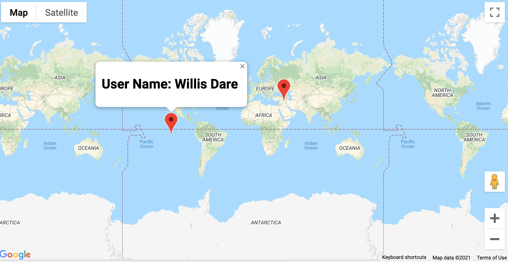

# little-maps

A web-application that shows markers of User and Company classes on the map; When the markers are click, info box about the markers will pop up.

It is a TypeScript demo powered by parcel, faker, and google.maps.

